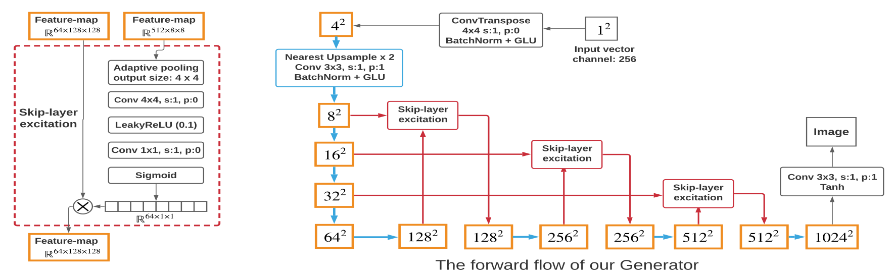

# Self-Supervised GAN
Implementation of the paper:

> Bingchen Liu, Yizhe Zhu, Kunpeng Song and Ahmed Elgammal. [Towards Faster and Stabilized GAN Training for High-fidelity Few-shot Image Synthesis](https://arxiv.org/abs/2101.04775). 




See [here](https://github.com/odegeasslbc/FastGAN-pytorch) for the official Pytorch implementation.


## Examples


## Dependencies
- Python 3.8
- Tensorfow 2.7
- Tensorflow Addons 0.15


## Usage
### Train
Use `--file_pattern=<file_pattern>` to provide the dataset path and file pattern.
```
python train.py --file_pattern=./dataset_path/*.jpg
```

### Hparams setting
Adjust hyperparameters on the `hparams.py` file.

### Tensorboard
Run `tensorboard --logdir ./`.


## References
Code:
- This model depends on other files that may be licensed under different open source licenses.
- Self-Supervised GAN uses Shengyu Zhao, Zhijian Liu, Ji Lin, Jun-Yan Zhu and Song Han. [Differentiable Augmentation](https://arxiv.org/abs/2006.10738). Under BSD 2-Clause "Simplified" License.

Implementation notes:
- Self-supervised discriminator with a single reconstruction decoder and perceptual loss.
- Hinge loss GAN and WGAN gradient penalty.
- Skip-layer excitation generator.
- Orthogonal initialization.
- Adam with β1 = 0.5 and β2 = 0.99. 
- Batch size = 8.


## Licence
MIT