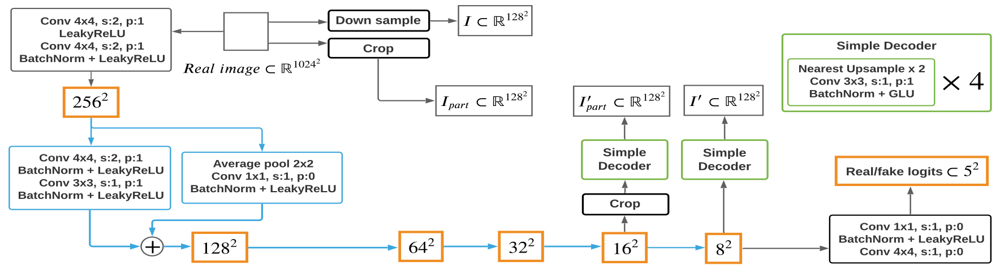

# Self-Supervised GAN
Implementation of the paper:

> Bingchen Liu, Yizhe Zhu, Kunpeng Song and Ahmed Elgammal. [Towards Faster and Stabilized GAN Training for High-fidelity Few-shot Image Synthesis](https://arxiv.org/abs/2101.04775). 

See [here](https://github.com/odegeasslbc/FastGAN-pytorch) for the official Pytorch implementation.

## Examples

## Dependencies
- Python 3.8
- Tensorfow 2.7

## Licence
MIT
